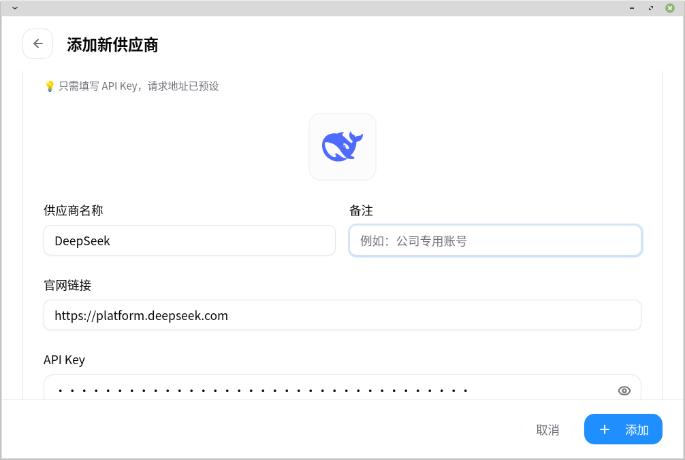
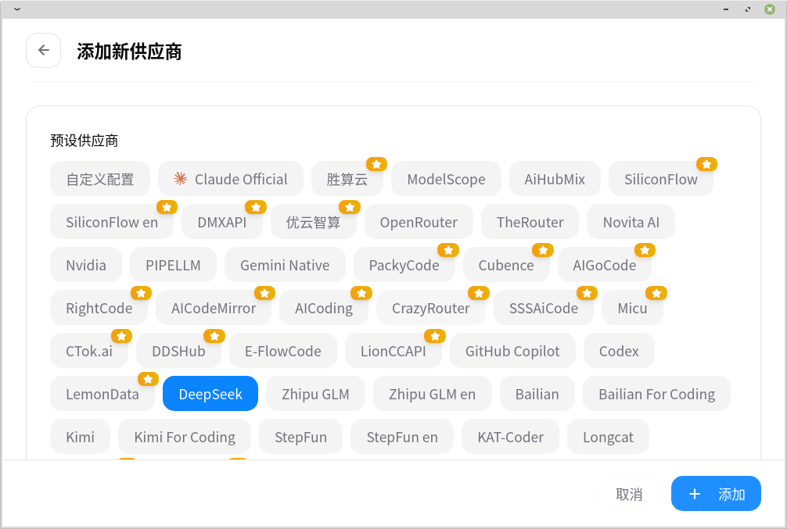
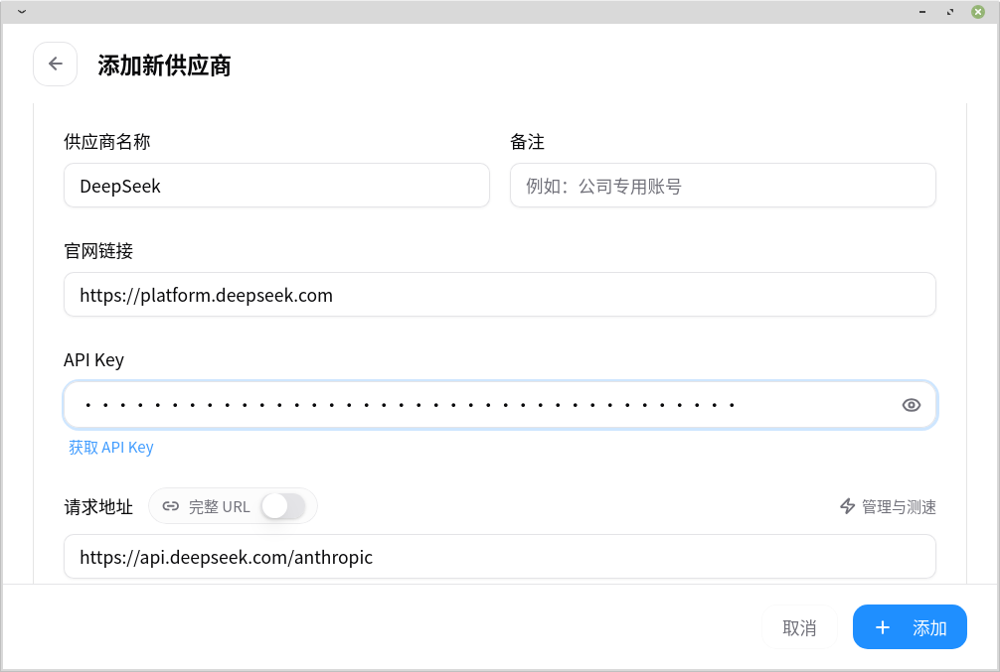
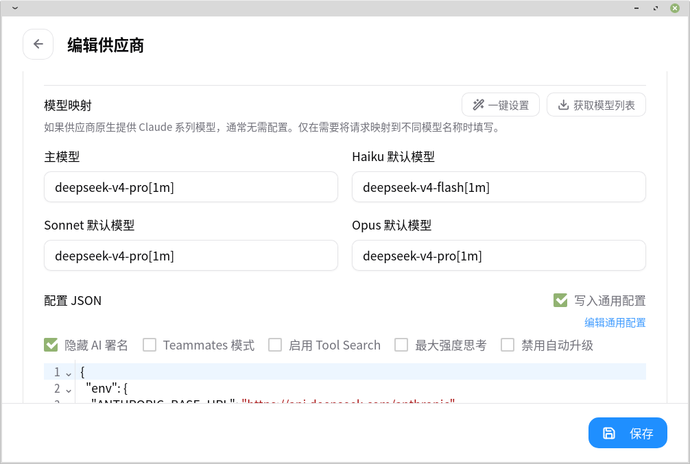

# 前言
现在DeepSeek V4 很火，模型能力足够强，还非常便宜。我在此介绍一下如何使用CC Switch 来把DeepSeek V4 这个优秀的模型接入Claude Code。

# 安装CC Switch
这个[Github Release链接](https://github.com/farion1231/cc-switch/releases/)直达下载，选择合适的操作系统版本安装即可。

进入CC Switch之后，点击右上角的橙色加号，就可以添加模型提供商的设置了。

选中DeepSeek,接着去获取一个API Key。
[DeepSeek 开放平台 控制台获取API Key](https://platform.deepseek.com/api_keys)

将API Key 填入框中，模型设置如图那样改。

Haiku 对应 `deepseek-v4-flash[1m]`,其他的对应`deepseek-v4-pro[1m]`，保存设置后回到主页面，将DeepSeek的新设置选中就可以在终端中输入`claude`开始编码了！

Enjoy vibe coding.

